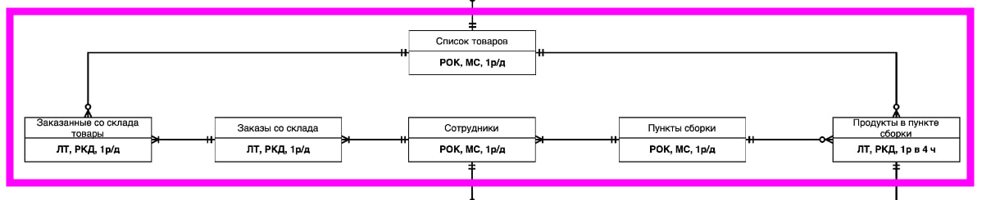

Вариант того, какую часть нашей системы мы возьмем



В миграциях накидана примерная структура базы данных, которую мы сможем реализовать. Можно добавить/накинуть/убрать поля.

Я так понимаю, что цель

1. Сделать общую структуру таблиц и добавить её в миграции
1. Наполнить общую структуру данными тоже через миграции
2. Сделать так, чтобы у нас на разных шардах были разные таблицы (возможно это делается через foreign table плюс сброс )
3. Нарисовать UML диаграммы бизнес процессов  
4. Построить бекенд над таблицами, которое позволит делать какой-то супер базовый круд
5. Построить фронтенд над бекендом


Как развернуть.
На мастере необходимо ввести команды, которые нужны для архивации, которая используется в репликации. 
Это делается в контейнере докера.
```
mkdir archives
chmod 777 archives/
```

Если  вдруг разворачиваем на разных серверах с реальными белыми ip, то тогда добавляем на всех машинах
в файл /var/lib/postgresql/data/pg_hba.conf данные для разрешения подключений
```
host    replication     all             ip/mask                 trust
```